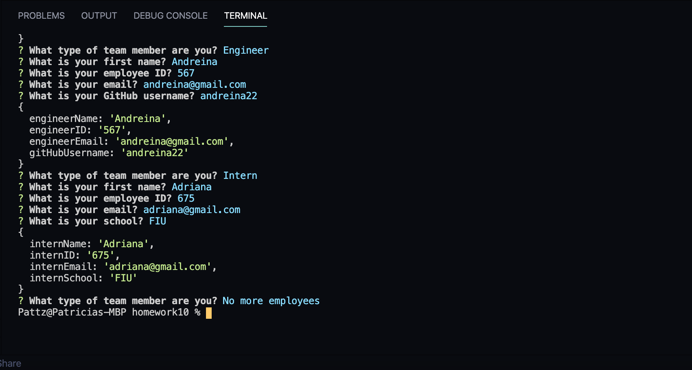

# Template Engine Employee Summary
Application that generates an HTML webpage to display a software engineering team.  Application ideally will pass unit tests.

## Screenshots

## Video

## Requirements

### lib folder - for classes and helper code
- 4 classes: Employee, Manager, Engineer, Intern

1. EMPLOYEE class - PARENT CLASS! Properties and methods include:
 * name
 * id
 * title
 * getName()
 * getID()
 * getEmail()
 * getRole() // Returns 'Employee'
 
2. MANAGER class - extend Employee class
 * will have all of the above properties for Employee class, plus the below properties and methods:
  + officeNumber
  + getRole // Overridden to return 'Manager'

3. ENGINEER class - extend Employee class
 * will have all of the above properties for Employee class, plus the below properties and methods:
  + github // GitHub usernam
  + getGitHub()
  + getRole // Overridden to return 'Manager'

4. INTERN class - extend Employee class
 * will have all of the above properties for Employee class, plus the below properties and methods:
  + school
  + getSchool()
  + getRole() // Overridden to return 'Intern'

### Output - rendered output
 * Team HTML - nicely formatted team roster
   + Name
   + Role
   + ID
   + Role-specific property (School, link to GitHub profile, or office number)

### Templates - HTML template for each type of user
 * Use the following templates:
  + main.html
  + engineer.html
  + intern.html
  + manager.html
 * Add placeholder character that helps program identify were te dynamic markup begins and ends.  See Test files for names.

### App.js
 * Runs the application

